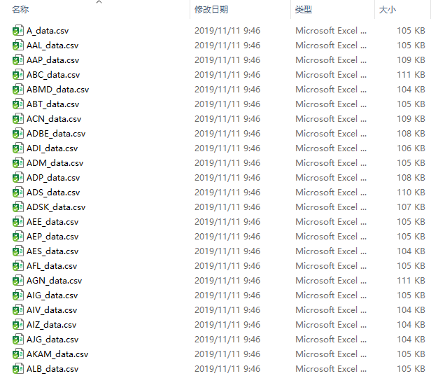
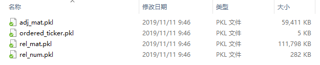

# Stock Movement Prediction Using Graph Attention Networks

**Authors: Yu Han, Zhen Chen, Xiaopeng Yu, Jiashu Liu**

This folder contains the code and data for our final project of CS410, Peking University.

#### Prerequisites

- Python 3
- Tensorflow 1.13.1
- Numpy
- Pandas

#### Data

The data can be downloaded and extracted by running

```shell
cd node_classification
bash download.sh
tar -xvf data.tar
cd ../graph_classification
bash download.sh
tar -xvf data.tar
```

Make sure you can access Google. Taking the node_classification data for example, it contains:



- data/price contains the price (daily pct_change) for the companies and the index.
- data/relation contains the relations. To be specific:
  - adj_mat.pkl contains a binary matrix of shape (#rel, #node, #node), which denotes whether the two companies are related by a certain relation
  - ordered_ticker.pkl contains a list of shape (#node, ), which is the names of the companies
  - rel_mat.pkl contains an array of (#rel, #node, padding), the index of the nodes related to each node for each relation
  - rel_num.pkl contains an array of (#rel, #node), which contains the number of neighbors of each node for each relation.
  
  

#### Running the program

For training the node classification model, run the following command:

```shell
cd node_classification
python src/main.py --n_epochs 300 --feature_list return --feat_att --rel_att --test_phase 1 --train_proportion 5 --save_dir save
```

The parameters are explained as follows:

- `--n_epochs`: the maximum number of epochs for training
- `--feature_list`: the feature to use, only supports "return" now
- `--feat_att` and `--rel_att`: specify the attention modules, if they are both omitted, the model falls back to the baseline model
- `--test_phase`: the phase to test on (also influences the training set), we use the phase 1, 3, 5, 7 and 9
- `--train_proportion`: specifies the number of days used for training, that is,  `train_proportion * 100`
- `--save_dir`: the directory to save the checkpoints

Other parameters can be found in config.py. You can also run `bash run.sh` to run the model, and run `bash run_base.sh` to run the baseline model.

 For training the graph classification model, run the following command:

```shell
cd graph_classification
python src/main.py --n_epochs 300 --data_type S5INFT --feature_list return --feat_att --rel_att --test_phase 1 --train_proportion 5 --save_dir save
```

The parameters are similar to the node classification model, except than the `--data_type` parameter, which denotes the index type, chosen from `['S5CONS', 'S5ENRS', 'S5UTIL', 'S5FINL', 'S5INFT']`.

#### Project Structure

We take the node_classification to explain the structure and important classes of the project.

- base
  - base_model.py: contains the base class for model
  - base_train.py: contains the base class for trainer, mainly implements log printing and saving checkpoints
- models
  - HATS.py: contains the main model, where the `build_model()` function defines the model behavior
- config.py: contains all parameters of the model
- dataset.py: contains the dataset class, where the `read()` function loads the data files and constructs the dataset splits, and the `get_batch()` function construct a batch of data
- trainer.py: contains the class for training, where the `sample_neighbors()` randomly selects neighborhood nodes for training, the `train_epoch()` and `train_step()` function perform training for an epoch and batch, respectively
- evaluator.py: contains the class for evaluation, where the `evaluate()` function performs the evaluation, and other functions calculates specific metrics
- main.py: contains the script for calling the above classes and functions for training, validation and testing
- demo.py: contains the script for testing the model and save the results for prediction
- logger.py: contains logging utilities

Please examine the code for more details.

#### Reference

The code is based on the [hats](https://github.com/dmis-lab/hats) github project. The modifications to the original code can be summarized in the following aspects:

- Data Processing: We re-designed the construction of dataset splits and batches, which utilizes the data more effectively. We also optimized the data label definition (threshold).
- Model: We modified the behavior of the model when there are not enough neighbors. For the node classification, we added the implementation of the baseline method (averaging out node and relation representations). For the graph classification, we added the implementation of the attention model (while the original code only implemented the baseline LSTM method).
- Training and Evaluation: We added the implementation of the Sharpe metric, and incorporated it into the training, validation and testing process. We also implemented the portfolio strategy that selects the top-n most confident predictions belonging to the up and down classes.  
- Demo: We added the script for running the inference procedure and saving the results for qualitative comparison. 
- Bug fixes: We fixed some bugs of the original code.

For more details, please examine the code.


